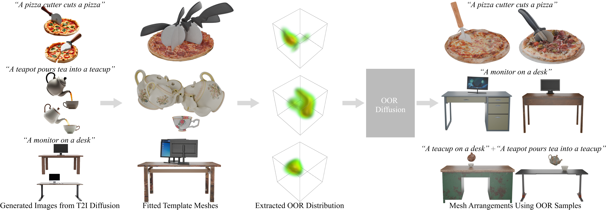

# <p align="center"> Learning 3D Object Spatial Relationships from Pre-trained 2D Diffusion Models </p>

## [Project Page](https://tlb-miss.github.io/oor/) &nbsp;|&nbsp; [Paper](https://arxiv.org/pdf/2501.08333) 



This is the official code for the paper "Learning 3D Object Spatial Relationships from Pre-trained 2D Diffusion Models".


## Regarding Code Release
- The code will be updated and available soon.
<!-- ## News -->


## Citation
```bibtex
@misc{david,
      title={DAViD: Modeling Dynamic Affordance of 3D Objects using Pre-trained Video Diffusion Models}, 
      author={Hyeonwoo Kim and Sangwon Beak and Hanbyul Joo},
      year={2025},
      eprint={2501.08333},
      archivePrefix={arXiv},
      primaryClass={cs.CV},
      url={https://arxiv.org/abs/2501.08333}, 
}
```

<!-- ## License
This work is licensed under a <a href="https://creativecommons.org/licenses/by-nc-sa/4.0/">Creative Commons Attribution-NonCommercial-ShareAlike 4.0 International License</a>. -->
